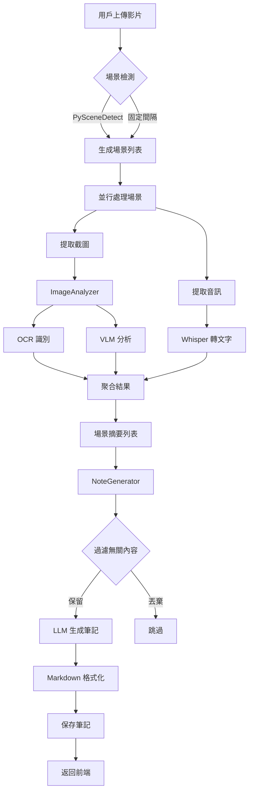
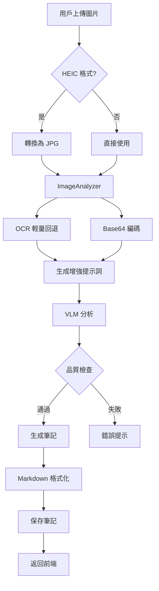

# 🏗️ 系統架構文檔

> **文件用途**: 系統技術架構總覽與模組關係說明  
> **適用對象**: 開發者、AI 助手、系統維護人員  
> **最後更新**: 2025-10-03  
> **版本**: v1.0

---

## 📋 目錄

1. [系統總覽](#系統總覽)
2. [技術棧](#技術棧)
3. [系統架構圖](#系統架構圖)
4. [模組說明](#模組說明)
5. [資料流程](#資料流程)
6. [Docker 容器架構](#docker-容器架構)
7. [AI 模型整合](#ai-模型整合)
8. [API 設計](#api-設計)

---

## 🎯 系統總覽

### 專案名稱
**自動筆記生成系統 (Automatic Note Generation System)**

### 核心功能
本系統是一個**基於 AI 的多模態筆記生成平台**,支援:
- 📹 **影片筆記生成**: 從講義影片中提取內容並生成結構化筆記
- 🖼️ **圖片筆記生成**: 從講義截圖中識別文字並生成筆記
- 🇯🇵 **雙語支援**: 支援中文繁體與日文內容處理
- 🤖 **本地 AI**: 使用本地部署的 LLM (Ollama) 處理數據
- 🎨 **現代化 UI**: Vue 3 + Element Plus 響應式界面

### 系統特色
1. **完全本地化**: 所有 AI 模型運行在本地,無需雲端 API
2. **GPU 加速**: 支援 NVIDIA GPU 加速推理
3. **多模態分析**: 結合 OCR、語音識別、視覺語言模型
4. **容器化部署**: Docker Compose 一鍵啟動
5. **實時監控**: GPU 使用率、記憶體佔用實時顯示

---

## 🛠️ 技術棧

### 後端技術

| 技術 | 版本 | 用途 |
|------|------|------|
| **Python** | 3.10+ | 主要開發語言 |
| **FastAPI** | 0.100+ | Web 框架,提供 RESTful API |
| **Uvicorn** | 0.23+ | ASGI 服務器 |
| **Ollama** | Latest | 本地 LLM 服務 (Qwen3-VL) |
| **Whisper** | Large-v3 | 語音識別 (OpenAI) |
| **PaddleOCR-VL** | 3.0+ | 結構化文字識別 (中/日/英) |
| **OpenCV** | 4.8+ | 影片處理與場景檢測 |
| **PySceneDetect** | 0.6+ | 場景切換檢測 |
| **Pillow** | 10.0+ | 圖片處理 |
| **SQLAlchemy** | 2.0+ | ORM (如需資料庫) |

### 前端技術

| 技術 | 版本 | 用途 |
|------|------|------|
| **Vue 3** | 3.3+ | 前端框架 (Composition API) |
| **Vite** | 4.4+ | 建構工具與開發服務器 |
| **Element Plus** | 2.3+ | UI 組件庫 |
| **Tailwind CSS** | 3.3+ | CSS 框架 |
| **marked.js** | 9.0+ | Markdown 渲染 |
| **highlight.js** | 11.8+ | 代碼高亮 |
| **Prism.js** | 1.29+ | 代碼語法高亮 (備用) |
| **Axios** | 1.5+ | HTTP 客戶端 |

### AI 模型

| 模型 | 用途 | 硬體需求 |
|------|------|----------|
| **Qwen3-VL:8k** | 視覺語言模型,圖片理解 | GPU 8GB+ |
| **Whisper Large-v3** | 語音轉文字 | GPU 6GB+ |
| **PaddleOCR-VL** | 結構化文字識別 (GPU 最佳化) | GPU 8GB+ 建議 |

### 部署工具

| 工具 | 版本 | 用途 |
|------|------|------|
| **Docker** | 24.0+ | 容器化 |
| **Docker Compose** | 2.20+ | 多容器編排 |
| **NVIDIA Container Toolkit** | Latest | GPU 支援 |

---

## 🏛️ 系統架構圖

### 整體架構

```
┌─────────────────────────────────────────────────────────────┐
│                        用戶瀏覽器                            │
│                    (localhost:5173)                         │
└────────────────┬────────────────────────────────────────────┘
                 │ HTTP/WebSocket
                 ▼
┌─────────────────────────────────────────────────────────────┐
│                     前端容器 (Vue 3)                         │
│  ┌─────────────────────────────────────────────────────┐   │
│  │  Vue Router  │  Vuex/Pinia  │  Component Tree      │   │
│  │  影片管理 UI │  筆記展示 UI │  系統監控 UI         │   │
│  └─────────────────────────────────────────────────────┘   │
└────────────────┬────────────────────────────────────────────┘
                 │ API Requests
                 ▼
┌─────────────────────────────────────────────────────────────┐
│                   後端容器 (FastAPI)                         │
│                    (localhost:18000)                        │
│  ┌─────────────────────────────────────────────────────┐   │
│  │                  API 路由層                         │   │
│  │  /api/process-video  │  /api/process-image         │   │
│  │  /api/status         │  /api/diagnose              │   │
│  └──────┬──────────────────────────────────────────────┘   │
│         │                                                    │
│  ┌──────▼────────────────────────────────────────────┐     │
│  │              業務邏輯層 (modules/)              │     │
│  ├──────────────────────────────────────────────────┤     │
│  │  summarize_video.py    影片摘要主流程          │     │
│  │  summarize_image.py    圖片分析主流程          │     │
│  │  note_generator.py     筆記生成器              │     │
│  │  image_analyzer.py     圖片分析器              │     │
│  │  llm_utils.py          LLM 調用工具            │     │
│  │  file_handlers.py      文件處理工具            │     │
│  └──────┬──────────────────────────────────────────┘     │
└─────────┼────────────────────────────────────────────────┘
          │
          ├──────────────┬─────────────┬──────────────┐
          ▼              ▼             ▼              ▼
┌──────────────┐ ┌──────────────┐ ┌──────────────┐ ┌────────────┐
│ Ollama 容器  │ │ Whisper      │ │ PaddleOCR-VL │ │ OpenCV     │
│ (Qwen3-VL) │ │ (語音識別)   │ │ (結構化 OCR) │ │ (影片處理) │
│ GPU 加速     │ │ GPU 加速     │ │ GPU 最佳化   │ │ CPU        │
└──────────────┘ └──────────────┘ └──────────────┘ └────────────┘
```

### 容器通訊架構

```
┌──────────────────────────────────────────────────────────┐
│                   Docker Network: app-network            │
│                                                           │
│  ┌────────────────┐         ┌────────────────────────┐  │
│  │  Frontend      │◄────────┤  Browser               │  │
│  │  :5173         │         │  localhost:5173        │  │
│  └────────┬───────┘         └────────────────────────┘  │
│           │                                               │
│           │ API Calls                                     │
│           ▼                                               │
│  ┌────────────────┐                                      │
│  │  Backend       │                                      │
│  │  :18000        │                                      │
│  └────────┬───────┘                                      │
│           │                                               │
│           ├────────────► Ollama :11434                   │
│           ├────────────► /app/models/whisper             │
│           └────────────► PaddleOCR-VL (內建)             │
│                                                           │
│  Volumes:                                                 │
│  - ./saved_notes:/app/saved_notes                        │
│  - ./output:/app/output                                  │
│  - F:/上課影片:/app/external_f/上課影片                   │
│  - F:/講義圖片:/app/external_f/講義圖片                   │
└──────────────────────────────────────────────────────────┘
```

---

## 📦 模組說明

### 核心模組 (modules/)

#### 1. `summarize_video.py` - 影片摘要主流程

**職責**:
- 影片場景檢測與切分
- 協調各 AI 模組處理每個場景
- 場景摘要聚合與去重

**主要函數**:
```python
async def summarize(
    filename, video_path, config, llm_config, status_manager,
    with_images=True, device="gpu", parse_audio=True,
) -> tuple[str, str, dict]:
    """
    影片摘要主函數
    
    Returns:
        (final_note: str, base_name: str, structured_data: dict)
    """
```

**處理流程**:
```
1. 場景檢測 (PySceneDetect/固定間隔)
   ↓
2. 並行處理每個場景 (process_scene)
   ├─ 截圖提取
   ├─ 語音識別 (Whisper)
   ├─ 圖片分析 (ImageAnalyzer)
   └─ VLM 分析 (Qwen3-VL)
   ↓
3. 場景去重與聚合
   ↓
4. 生成最終筆記 (NoteGenerator)
   ↓
5. 返回 Markdown 格式筆記
```

#### 2. `summarize_image.py` - 圖片分析主流程

**職責**:
- 圖片格式轉換 (HEIC → JPG)
- 調用 ImageAnalyzer 分析圖片
- 生成圖片筆記

**主要函數**:
```python
async def summarize_image(
    filename, config, llm_config, status_manager,
    device="gpu", skip_ocr=True,
) -> tuple[str, str]:
    """
    圖片摘要主函數
    
    Returns:
(final_note: str, tmp_filename: str)
"""
```

> **狀態管理**  
> 影片與圖片兩條管線皆透過 `modules/services/status_manager.py` 的 `StatusManager` 單例同步更新進度、錯誤與系統指標，確保背景執行緒與 async 任務在不同執行環境下都能安全讀寫狀態。

#### 3. `image_analyzer.py` - 圖片分析器

**職責**:
- OCR 文字識別
- 圖片編碼 (Base64)
- 調用 VLM 分析圖片
- 結合 OCR + VLM 結果

**核心類**:
```python
class ImageAnalyzer:
    async def analyze_image(
        self, image_path, context="", 
        skip_ocr=False, language="zh-TW"
    ) -> dict:
        """
        分析圖片並返回結果
        
        Returns:
            {
                'success': bool,
                'analysis': str,  # VLM 分析結果
                'ocr_text': str,  # OCR 識別文字
                'image_path': str,  # 處理後的圖片路徑
                'error': str  # 錯誤訊息 (如有)
            }
        """
```

**處理邏輯**:
```
1. HEIC 格式檢查與轉換
   ↓
2. OCR 文字識別 (可選)
   ├─ 主 OCR: PaddleOCR-VL 結構化輸出
   └─ 輕量回退: PaddleOCR-VL 純文字提取
   ↓
3. 圖片編碼 Base64
   ↓
4. 生成增強提示詞 (OCR 上下文)
   ↓
5. 調用 VLM (Qwen3-VL)
   ↓
6. 品質檢查與回傳
```

#### 4. `note_generator.py` - 筆記生成器

**職責**:
- 聚合多個場景的分析結果
- 過濾無關內容 (噪音關鍵字、低日文比例)
- 調用 LLM 生成結構化筆記
- Markdown 格式化

**核心類**:
```python
class NoteGenerator:
    async def generate_final_summary(
        self, scene_summaries, 
        language="zh-TW", include_japanese=True
    ) -> tuple[str, list]:
        """
        生成最終筆記
        
        Returns:
            (final_note: str, structured_summaries: list)
        """
```

**過濾邏輯**:
```python
# 噪音關鍵字過濾
noise_keywords = [
    'google.com', 'chrome://', 'localhost',
    'download', 'gmail', 'search'
]

# 日文比例過濾 (程式設計課程需要大量英文代碼)
jp_ratio_threshold = 0.05  # 5%
```

#### 5. `llm_utils.py` - LLM 調用工具

**職責**:
- 統一的 Ollama API 調用接口
- 支援文字和多模態 (帶圖片) 請求
- 錯誤處理與重試機制
- 提示詞模板管理

**主要函數**:
```python
async def call_ollama_llm(
    prompt: str,
    model: str = "qwen3-vl:4b",
    image: str = None,  # Base64 圖片
    use_cache: bool = False,
    language: str = "zh-TW",
    num_ctx: int = 8192
) -> dict:
    """
    調用 Ollama LLM
    
    Returns:
        {
            'message': {
                'content': str  # LLM 回應
            }
        }
    """
```

#### 6. `file_handlers.py` - 文件處理工具

**職責**:
- 影片/圖片文件列舉
- 路徑解析與驗證
- 文件格式轉換
- 臨時文件管理

---

## 🔄 資料流程

### 影片處理流程



### 圖片處理流程



---

## 🐳 Docker 容器架構

### docker-compose.yml 概覽

```yaml
version: '3.8'

services:
  # 前端服務
  frontend:
    build: ./frontend
    ports:
      - "5173:5173"
    networks:
      - app-network
    depends_on:
      - backend
  
  # 後端服務
  backend:
    build: .
    ports:
      - "18000:8000"
    volumes:
      - ./saved_notes:/app/saved_notes
      - ./output:/app/output
      - F:/上課影片:/app/external_f/上課影片
      - F:/講義圖片:/app/external_f/講義圖片
    environment:
      - OLLAMA_BASE_URL=http://ollama:11434
    networks:
      - app-network
    deploy:
      resources:
        reservations:
          devices:
            - driver: nvidia
              count: 1
              capabilities: [gpu]
  
  # Ollama LLM 服務
  ollama:
    image: ollama/ollama:latest
    ports:
      - "11434:11434"
    volumes:
      - ./ollama_models:/root/.ollama
    networks:
      - app-network
    deploy:
      resources:
        reservations:
          devices:
            - driver: nvidia
              count: 1
              capabilities: [gpu]

networks:
  app-network:
    driver: bridge
```

### GPU 資源分配

| 容器 | GPU 使用 | VRAM 需求 | 說明 |
|------|---------|-----------|------|
| **Ollama** | 主要 | 8-10 GB | Qwen3-VL 推理 |
| **Backend** | 輔助 | 2-4 GB | Whisper 語音識別 |

**注意**: 兩個容器共享同一張 GPU,總 VRAM 需求約 12 GB。

---

## 🤖 AI 模型整合

### 模型架構圖

```
┌─────────────────────────────────────────────────┐
│              AI 模型整合層                       │
├─────────────────────────────────────────────────┤
│                                                  │
│  ┌──────────────┐  ┌──────────────┐  ┌────────┐│
│  │ Qwen3-VL   │  │ Whisper-v3   │  │Paddle  ││
│  │ 視覺語言模型 │  │ 語音識別     │  │OCR     ││
│  │ 8B 參數      │  │ Large        │  │中日文  ││
│  │ GPU: 8GB     │  │ GPU: 4GB     │  │CPU/GPU ││
│  └──────┬───────┘  └──────┬───────┘  └───┬────┘│
│         │                  │               │     │
│         │  多模態理解      │  語音轉文字   │文字  │
│         │  (圖片+文字)     │               │識別  │
│         ▼                  ▼               ▼     │
│  ┌──────────────────────────────────────────┐  │
│  │         統一的結果聚合層                  │  │
│  │  - 場景理解 (VLM)                        │  │
│  │  - 語音內容 (ASR)                        │  │
│  │  - 文字識別 (OCR)                        │  │
│  └──────────────────────────────────────────┘  │
└─────────────────────────────────────────────────┘
```

### 模型選擇原因

#### Qwen3-VL:8k
- ✅ 支援中日文理解
- ✅ 視覺+語言多模態
- ✅ Context 長度 8192 tokens
- ✅ 本地部署,無需雲端 API
- ⚠️ 需要 8GB+ VRAM

#### Whisper Large-v3
- ✅ 最佳的語音識別準確度
- ✅ 支援多語言 (中日英)
- ✅ 時間戳對齊
- ⚠️ 推理速度較慢 (GPU 加速)

#### PaddleOCR-VL
- ✅ 結構化輸出 (文字 + 版面)
- ✅ 支援中/日/英多語
- ✅ GPU 加速批次推論
- ✅ 與 PP-Structure 深度整合

---

## 🔌 API 設計

### RESTful API 端點

#### 影片處理

**POST** `/api/process-video`

**請求體**:
```json
{
  "filename": "lecture_20240101.mp4",
  "device": "gpu",
  "with_images": true,
  "parse_audio": true,
  "language": "zh-TW",
  "include_japanese": true
}
```

**響應**:
```json
{
  "status": "processing",
  "progress": 45,
  "detail": "處理場景 3/10..."
}
```

#### 圖片處理

**POST** `/api/process-image`

**請求體**:
```json
{
  "filename": "slide_001.jpg",
  "device": "gpu",
  "language": "zh-TW"
}
```

**響應**:
```json
{
  "result": "# 筆記內容...",
  "tmp_filename": "slide_001.md"
}
```

#### 系統狀態

**GET** `/api/status/{filename}`

**響應**:
```json
{
  "status": "completed",
  "status_code": "completed",
  "progress": 100,
  "detail": "筆記生成成功!",
  "result_path": "output/lecture_20240101.md",
  "structured": { /* 結構化數據 */ }
}
```

#### 系統診斷

**GET** `/api/diagnose`

**響應**:
```json
{
  "gpu": {
    "available": true,
    "name": "NVIDIA RTX 4070",
    "memory_total": 12288,
    "memory_used": 9550,
    "temperature": 52,
    "utilization": 75
  },
  "models": {
    "ollama": "online",
    "whisper": "loaded"
  }
}
```

### WebSocket (計劃中)

用於實時進度更新:
```javascript
ws://localhost:18000/ws/processing/{filename}
```

---

## 📝 配置文件

### config.yaml

```yaml
# LLM 配置
llm:
  base_url: "http://ollama:11434"
  image_model: "qwen3-vl:4b"
  final_model: "qwen3-vl:4b"
  num_ctx: 8192

# OCR 配置
ocr:
  engine: "paddleocr-vl"
  primary_lang: "japan"
  languages:
    - "japan"
    - "ch"
    - "en"
  use_gpu: true
  device_id: 0
  batch_size: 10
  enable_angle_cls: true
  min_confidence: 0.35
  model_root: "data/models/paddleocr_vl"
  layout:
    enabled: true
    model_dir: "data/models/paddleocr_vl/PP-DocLayoutV2"
    structure_version: "PP-DocLayoutV2"
    detect_tables: true
    score_threshold: 0.3

# Whisper 配置
whisper:
  model_size: "large-v3"
  device: "cuda"
  compute_type: "float16"

# 場景檢測
scene_detect:
  threshold: 20.0
  min_scene_length: 3.0
```

### paths_config.json

```json
{
  "video_path": "F:/上課影片",
  "image_path": "F:/講義圖片"
}
```

路徑設定的讀寫與容器路徑轉換由 `modules/services/media_paths.py` 的 `MediaPathService` 統一處理，FastAPI 路由與背景任務都透過該服務取得最新配置，避免重複讀寫 `paths_config.json` 或產生不一致的掛載路徑。

---

## 🔍 開發指南

### 本地開發環境搭建

1. **克隆倉庫**
   ```bash
   git clone <repo-url>
   cd 自動筆記駐守2
   ```

2. **安裝後端依賴**
   ```bash
   pip install -r requirements.txt
   ```

3. **啟動 Ollama**
   ```bash
   docker-compose up -d ollama
   ollama pull qwen3-vl:4b
   ```

4. **啟動後端**
   ```bash
   python main.py
   ```

5. **啟動前端**
   ```bash
   cd frontend
   npm install
   npm run dev
   ```

### 添加新功能

#### 添加新的 API 端點

1. 在 `main.py` 中定義路由:
```python
@app.post("/api/new-feature")
async def new_feature(param: str = Form(...)):
    # 實現邏輯
    return JSONResponse(content={"result": "success"})
```

2. 在前端調用:
```javascript
const response = await axios.post('/api/new-feature', {
  param: value
});
```

#### 整合新的 AI 模型

1. 修改 `llm_utils.py`:
```python
async def call_new_model(prompt: str):
    # 調用新模型的邏輯
    pass
```

2. 更新 `config.yaml`:
```yaml
llm:
  new_model: "model-name:tag"
```

---

## 🐛 除錯與日誌

### 日誌系統

```python
import logging

logger = logging.getLogger(__name__)
logger.setLevel(logging.INFO)

# 輸出到文件
file_handler = logging.FileHandler('logs/notegen.log')
logger.addHandler(file_handler)

# 輸出到控制台
console_handler = logging.StreamHandler()
logger.addHandler(console_handler)
```

### 查看日誌

```bash
# Docker 日誌
docker logs notegen-backend-enhanced --tail 100

# 應用日誌
tail -f logs/notegen.log

# GPU 使用情況
nvidia-smi -l 1
```

---

## 📚 相關文檔

- [配置說明文檔](./CONFIGURATION.md)
- [Docker 部署指南](./docs/DOCKER_DEPLOYMENT.md)
- [故障排除指南](./docs/TROUBLESHOOTING.md)
- [API 參考文檔](./docs/API_REFERENCE.md) (待建立)

---

*本文檔由 AI 助手於 2025-10-03 生成,持續維護中*

